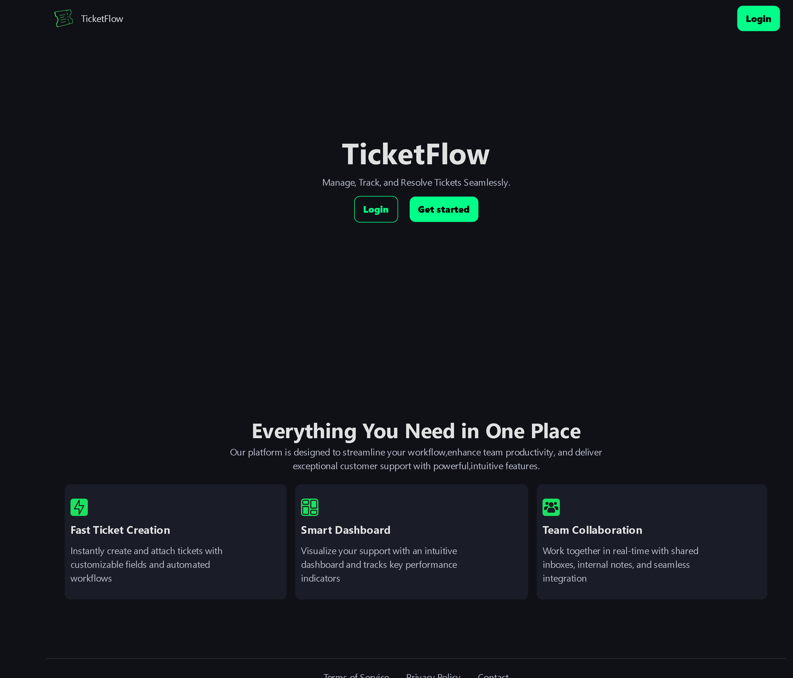

# 🎫 Ticket Management Web App – Frontend


A modern and responsive frontend application for managing support tickets efficiently.  
Built with a focus on clean UI, smooth user experience, and scalable architecture.

---

## 🚀 Live Demo

👉 https://ticket-management-web-app-bay.vercel.app

---

## 📖 Overview

This is the frontend of a full-stack Ticket Management System that allows users to:

- Register and log in securely
- Create and manage support tickets
- View ticket status and updates
- Interact with a clean and intuitive dashboard

The app communicates with a backend API for authentication and ticket operations.

---

## ✨ Features

- 🔐 User Authentication (Login / Register)
- 🎫 Create, view, and manage tickets
- 📊 Dashboard for tracking ticket status
- ⚡ Fast and responsive UI
- 🌐 API integration with backend
- 🔄 Real-time feedback for user actions
- 📱 Fully responsive design

---

## 🛠️ Tech Stack

- **React.js** – Frontend framework
- **Redux Toolkit** – State management
- **RTK Query / Fetch API** – API handling
- **CSS / Tailwind / Custom Styling** – UI design
- **Vite** – Build tool

---

## 📂 Project Structure

```

src/
│
├── app/              # Redux store setup
├── features/         # Redux slices & API logic
├── components/       # Reusable UI components
├── pages/            # Page-level components
├── hooks/            # Custom hooks
├── utils/            # Helper functions
└── main.jsx          # Entry point

```

---

## 🔌 API Integration

The frontend connects to the backend API:

```

[https://ticket-management-webapp-backend.onrender.com/api](https://ticket-management-webapp-backend.onrender.com/api)

```

### Example Endpoints:
- `POST /users/login`
- `POST /users/register`
- `GET /tickets`
- `POST /tickets`

---

## ⚠️ CORS Note

Ensure the backend allows requests from:

```

[https://ticket-management-web-app-bay.vercel.app](https://ticket-management-web-app-bay.vercel.app)

```

⚠️ Important:  
Do NOT include a trailing slash (`/`) in the allowed origin.

---

## 🧑‍💻 Getting Started

### 1. Clone the repo

```

git clone [https://github.com/your-username/ticket-management-frontend.git](https://github.com/your-username/ticket-management-frontend.git)

cd ticket-management-frontend

```

---

### 2. Install dependencies

```

npm install

```

---

### 3. Run development server

```

npm run dev

```

---

### 4. Build for production

```

npm run build

```

---

## 🔐 Environment Variables

Create a `.env` file:

```

VITE_API_URL=[https://ticket-management-webapp-backend.onrender.com/api](https://ticket-management-webapp-backend.onrender.com/api)

```

---

## 📸 Screenshots (Optional)

Add screenshots here to showcase:
- Login page
- Dashboard
- Ticket creation page

---

## 📈 Future Improvements

- 🔔 Notifications system
- 📬 Email integration
- 🧠 Advanced filtering & search
- 📊 Analytics dashboard
- 🌙 Dark mode

---

## 🤝 Contributing

Contributions are welcome!  
Feel free to fork this repo and submit a pull request.

---

## 📄 License

This project is open-source and available under the MIT License.

---

## 🙌 Acknowledgements

Built as part of a full-stack learning journey and real-world project practice.

---

## 👨‍💻 Author

**Babatunde Adegboye**  
Frontend Developer | Building scalable web apps

---

```

---